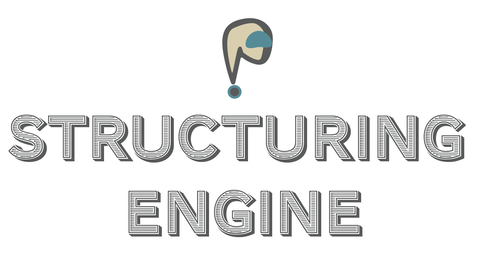

<p align="center">
  
</p>

<h1 align="center">Proxy Structuring Engine (PSE)</h1>

<h2 align="center">
  <strong>Guaranteed structured outputs from any language model.</strong>
</h2>

<p align="center" style="font-size: 1.2em; width: 350px; margin: 0 auto; padding-bottom: 20px;">
  Eliminate 100% of schema violations and state tracking failures in your LLM applications.
</p>

<p align="center">
  <a href="#"></a>
  <a href="https://github.com/TheProxyCompany/proxy-structuring-engine/actions/workflows/python-app.yml"></a>
  <a href="https://pypi.org/project/pse/"></a>
</p>
<p align="center">
  <a href="https://github.com/TheProxyCompany/proxy-structuring-engine/blob/main/LICENSE"></a>
  <a href="https://docs.theproxycompany.com/pse/"></a>
</p>

---

## Raw LLM outputs break systems.

Attempts to force structure via prompting are inconsistent. Post-processing with regex or validation loops is inefficient, error-prone, and fails fundamentally on complex, nested formats.

We set out to solve this fundamental problem - and the solution is the **Proxy Structuring Engine (PSE)**. It is designed for runtime guarantees, engineering-grade reliability, and an extensible interface for structuring LLM outputs.

The PSE integrates directly into the LLM's generation loop. You define the required output structure using familiar tools (Pydantic, JSON Schema, function signatures) or compose custom constraints using PSE's types. Its core Hierarchical State Machine (HSM) engine translates this into a stateful grammar validator. The result: **Structurally perfect output, generated correctly the first time.**

## Core Capabilities

*   ✅ **100% Structural Guarantee:** Eliminate schema violations, parsing errors, and malformed outputs. Outputs conform precisely to your defined structure, enabling reliable downstream processing and state tracking.
*   ⚙️ **Master Complexity & Recursion:** Reliably generate deeply nested JSON, valid code, complex API calls, or custom recursive formats. PSE's Hierarchical State Machine (HSM) engine thrives where simpler methods fail.
*   🚀 **Effortless Schema Definition:** Configure PSE instantly using **Pydantic models**, **Python function signatures**, or standard **JSON Schema**. Focus on your application logic, not grammar implementation.
*   🛡️ **Unmatched Robustness:** Built-in **Token Healing** intelligently recovers from tokenization artifacts and minor LLM deviations, preventing cascading failures. Ambiguity is resolved via principled path selection.
*   ⚡ **High-Performance Engine:** Optimized state-machine engine delivers guaranteed structure with minimal latency impact, benchmarked for efficiency. *(Link to Benchmarks needed)*
*   🔌 **Universal Compatibility:** Integrates with any LLM stack via standard logits processing (`process_logits`) and sampling (`sample`) hooks. Seamless integration with `transformers` (PyTorch, TF, JAX) via optional mixins. Works with local models.
*   🧩 **Advanced Grammar Composition:** Go beyond standard schemas. Use `pse.types` (`Chain`, `Loop`, `Any`, `Encapsulated`, `WaitFor`, `Character`, `Phrase`, Lark grammars) to build powerful, custom HSMs for bespoke structural requirements.

## Installation

```bash
pip install pse
```
*or*:
```bash
uv pip install pse
```

*(Installs the `pse` Python library and its required dependency `pse-core`, containing the pre-compiled engine. See the [Installation Docs](https://docs.theproxycompany.com/pse/getting-started/installation/) for framework-specific extras)*

## Quickstart: Pydantic to Guaranteed JSON

```python
import torch
from transformers import AutoTokenizer, LlamaForCausalLM
from pydantic import BaseModel

# Assuming PSE is installed:
from pse import StructuringEngine
from pse.util.torch_mixin import PSETorchMixin # Optional: Mixin for easy HF integration

# 1. Define your desired output structure using Pydantic
class UserProfile(BaseModel):
    user_id: int
    username: str
    is_active: bool
    roles: list[str]

# 2. (Optional) Apply the PSE mixin to your Hugging Face model class
class PSE_Llama(PSETorchMixin, LlamaForCausalLM):
    pass

# 3. Load your model and tokenizer
model_path = "meta-llama/Llama-3.2-1B-Instruct" # Example model
tokenizer = AutoTokenizer.from_pretrained(model_path)
model = PSE_Llama.from_pretrained( # Or your base model class
    model_path,
    torch_dtype=torch.bfloat16,
    device_map="auto"
)

# Ensure padding token is set for generation
if tokenizer.pad_token is None: tokenizer.pad_token = tokenizer.eos_token
model.config.pad_token_id = tokenizer.pad_token_id

# 4. Create the StructuringEngine instance.
#    (Using the mixin attaches it as model.engine)
model.engine = StructuringEngine(tokenizer)

# 5. Configure the engine with your Pydantic model
#    PSE compiles this into an efficient HSM representation.
model.engine.configure(UserProfile)

# 6. Create your prompt
prompt = f"Generate a user profile for user ID 999, username 'tester', active status true, roles ['qa', 'dev']. Output ONLY the JSON object."
messages = [{"role": "user", "content": prompt}]
input_ids = tokenizer.apply_chat_template(
    messages, return_tensors="pt", add_generation_prompt=True
).to(model.device)

# 7. Generate using the engine's processor and sampler
output_ids = model.generate(
    input_ids,
    max_new_tokens=150,
    do_sample=True,
    logits_processor=[model.engine.process_logits], # <-- PSE enforces structure here
    sampler=model.engine.sample                 # <-- PSE handles sampling & state here
)

# 8. Decode and parse the guaranteed structured output
output_text = tokenizer.decode(output_ids[0][input_ids.shape[-1]:], skip_special_tokens=True)
print("Raw Output (Guided by PSE):\n", output_text)

# PSE guarantees this output can be parsed directly into your Pydantic model
structured_output: UserProfile = model.engine.get_structured_output(UserProfile)
print("\nParsed Pydantic Object:\n", structured_output)
# Example Parsed Output:
# UserProfile(user_id=999, username='tester', is_active=True, roles=['qa', 'dev'])
```

### More Examples

See the [examples/](examples/) directory:

*   **`simple_demo.py`:** JSON Schema usage.
*   **`thinking_answer.py`:** Composing custom `StateMachine` types for structured reasoning flows.

## Why PSE?

| **Capability**                 | **PSE (Runtime HSM Enforcement)** | **Prompting / Retries** | **Regex / Post-Processing** | **Simple Masking / Templates** |
| :----------------------------- | :-------------------------- | :---------------------- | :-------------------------- | :----------------------------- |
| **Guaranteed Structure**       | ✅ **100%**                 | ❌ Probabilistic        | ❌ Fixes Errors (Maybe)     | ⚠️ Flat Only                   |
| **Complex/Nested Structures**  | ✅ **Handles Deeply**       | ❌ Brittle / Fails      | ❌ Impractical / Slow       | ❌ Cannot Handle               |
| **Recursion Handling**         | ✅ **Natively**             | ❌ No                   | ❌ No                       | ❌ No                          |
| **Reliability**                | ✅ **Production Grade**     | ❌ Low / Inconsistent   | ⚠️ Error-prone            | ⚠️ Brittle                     |
| **Token Healing**              | ✅ **Built-in**             | N/A                     | N/A                         | ❌ Breaks                      |
| **Performance**                | ✅ **Optimized Engine**     | Variable (Retries Cost) | ❌ Slow                     | ✅ Fast (Simple)               |

## Integration

Integrate PSE via two hooks:
1.  **Logits Processing:** Add `engine.process_logits` to your `logits_processor` list.
2.  **Sampling:** Use `engine.sample` (wrapping your base sampler) as your sampling function.

Works with PyTorch, TensorFlow, JAX, MLX, etc. `transformers` mixins available.

## Foundation for Reliable Agents: Proxy Base Agent (PBA)

PSE's guarantees enable the **[Proxy Base Agent (PBA)](https://github.com/TheProxyCompany/proxy-base-agent)**:

*   Reliable stateful execution (Planning/Action phases via HSM).
*   Guaranteed tool I/O structuring.
*   Dynamic, runtime tool integration (MCP).

## License

The `pse` Python library is licensed under Apache 2.0 ([LICENSE](LICENSE)).
The required `pse-core` dependency contains the pre-compiled, high-performance engine; its source code is proprietary (Patent Pending) and not available under the Apache 2.0 license.

## Contact

*   **Issues/Support:** [Open an Issue](https://github.com/TheProxyCompany/proxy-structuring-engine/issues)
*   **Commercial Services:** [The Proxy Company Business Services](https://theproxycompany.com/business) (Custom Development, Integration, Support, Partnerships)

## Citation

```bibtex
@software{Wind_Proxy_Structuring_Engine_2025,
  author = {Wind, Jack},
  title = {{Proxy Structuring Engine: Guaranteed Structured Output via Hierarchical State Machines}},
  year = {2025},
  publisher = {The Proxy Company},
  url = {https://github.com/TheProxyCompany/proxy-structuring-engine},
  version = {PUT_VERSION_HERE}, # Replace
  month = {RELEASE_MONTH}, # Replace
  date = {RELEASE_DATE} # Replace
}
```
