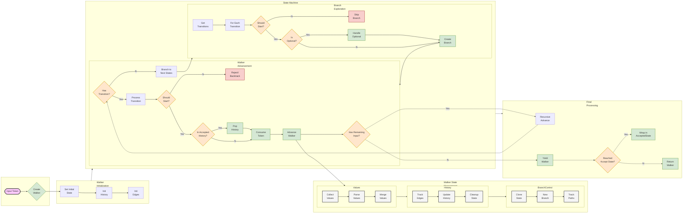

```mermaid
graph LR
    subgraph " "
        Start([Input Token]) --> InitWalker{Create<br>Walker}
    end

    subgraph WalkerInit["Walker<br>Initialization"]
        direction LR
        InitWalker --> InitState["Set Initial<br>State"] --> InitHist["Init<br>History"] --> InitEdges["Init<br>Edges"]
    end

    subgraph StateMachine["State Machine<br>Processing"]
        direction LR
        HasTrans{"Has<br>Transition?"}

        subgraph Branching["Branch<br>Exploration"]
            direction LR
            GetTrans["Get<br>Transitions"] --> ForEachTrans["For Each<br>Transition"] --> ValidStart{"Should<br>Start?"}
            ValidStart --No--> SkipBranch[Skip<br>Branch]
            ValidStart --Yes--> IsOptional{"Is<br>Optional?"}
            IsOptional --Yes--> OptionalPath[Handle<br>Optional] --> CreateNew["Create<br>Branch"]
            IsOptional --No--> CreateNew
        end

        subgraph Processing["Walker<br>Advancement"]
            direction LR
            HasTrans --No--> GetNewBranches["Branch to<br>Next States"]
            HasTrans --Yes--> ProcTrans["Process<br>Transition"] --> StartCheck{"Should<br>Start?"}
            StartCheck --No--> RejectPath[Reject/<br>Backtrack]
            StartCheck --Yes--> HistCheck{"In Accepted<br>History?"}
            HistCheck --Yes--> PopHist["Pop<br>History"] --> ConsToken["Consume<br>Token"]
            HistCheck --No--> ConsToken
            ConsToken --> AdvancedWalker["Advance<br>Walker"] --> RemCheck{"Has Remaining<br>Input?"}
        end
        GetNewBranches --> Branching
        CreateNew --> Processing
    end

    subgraph StateManagement["Walker State<br>Management"]
        direction LR
        AdvancedWalker --> Values["Value<br>Processing"] --> History["History<br>Mgmt"] --> BranchControl["Branch<br>Mgmt"]

        subgraph Values
            direction LR
            RawVal["Collect<br>Values"] --> ParseVal["Parse<br>Values"] --> MergeVal["Merge<br>Values"]
        end

        subgraph History
            direction LR
            TrackEdge["Track<br>Edges"] --> UpdateHistory["Update<br>History"] --> Cleanup["Cleanup<br>State"]
        end

        subgraph BranchControl
            direction LR
            CloneState["Clone<br>State"] --> CreateBranch["New<br>Branch"] --> TrackPaths["Track<br>Paths"]
        end
    end

    WalkerInit --> StateMachine

    subgraph Final["Final<br>Processing"]
        RemCheck --Yes--> RecurseAdv["Recursive<br>Advance"] --> HasTrans
        RemCheck --No--> YieldWalk["Yield<br>Walker"] --> AcceptCheck{"Reached<br>Accept State?"}
        AcceptCheck --Yes--> WrapAccept["Wrap in<br>AcceptedState"]
        AcceptCheck --No--> ReturnWalk["Return<br>Walker"]
    end
    StateMachine --> Final

    %% Styling classes
    classDef decision fill:#ffe6cc,stroke:#d79b00,stroke-width:2px
    classDef action fill:#d5e8d4,stroke:#82b366,stroke-width:2px
    classDef process fill:#f5f5f5,stroke:#333,stroke-width:2px
    classDef reject fill:#f8cecc,stroke:#b85450,stroke-width:2px

    class ValidStart,HasTrans,StartCheck,HistCheck,RemCheck,AcceptCheck,IsOptional decision
    class InitWalker,CreateNew,PopHist,ConsToken,AdvancedWalker,YieldWalk,WrapAccept,ReturnWalk,OptionalPath action
    class RawVal,ParseVal,MergeVal,TrackEdge,UpdateHistory,Cleanup,CloneState,CreateBranch,TrackPaths process
    class RejectPath,SkipBranch reject

    style Start fill:#ffccff,stroke:#333,stroke-width:2px

    linkStyle 0,1,2,3,4,5,6,7,8,9,10,11,12,13,14,15,16,17,18,19,20,21,22,23,24,25,26,27,28,29,30 stroke-width:1.5px;
```
